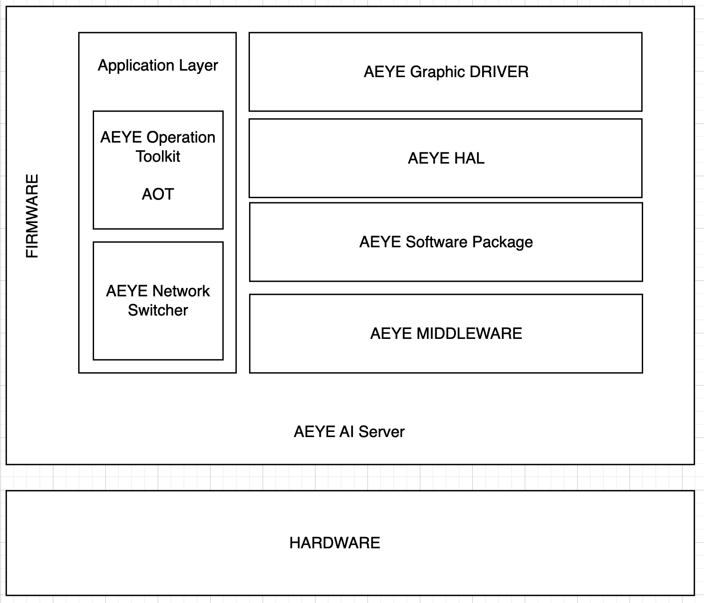

# AEYE_AI
AEYE 프로젝트 AI 드라이버 입니다.

AI 서버의 애플리케이션 레이어는 Django를 이용하여 개발되었으며, HAL 드라이버는 Flask를 통해 GPU와 AI 서버 간의 소통이 가능하도록 설계하였습니다. Flask는 Django 서버로부터 이미지 데이터와 추론에 필요한 Weight 파일을 받아 TensorFlow를 활용하여 추론을 수행합니다. 이 과정에서 Weight 파일과 이미지 파일을 한 번에 전송하면 HTTP 통신 문제가 발생하여 여러 번 전송되는 문제가 있으므로, Django는 이미지 파일과 Weight 파일을 여러 개의 청크로 나누어 전송합니다. 

Django에 LangChain을 결합하여 AI가 추론한 결과를 GPT가 받아 사전에 정의된 프롬프트를 통해 본 서비스의 품질을 향상시켰습니다.


AEYE AI 드라이버는 Docker를 통해 어느 환경에서나 제약 없이 동작할 수 있도록 설계되었습니다. 이번 프로젝트에서는 AWS에서 EC2 인스턴스를 생성하고, Route 53에서 도메인을 구매하여 AI 서버와 도메인을 연결하였으며, EC2 G4 인스턴스를 사용하여 Nvidia T4 그래픽 카드에서 동작하는 것을 확인하였습니다

AI 드라이버는 Application Layer, MiddleWare, HAL, Software Package로 구성되어 있습니다.

<p align="center">
  
</p>


---
### AEYE 란?
AEYE는 AI를 통해 안저 질환을 구별하는 플랫폼입니다. OCT 이미지를 업로드하면, AI가 해당 이미지를 기반으로 추론하고, GPT를 활용하여 더 자세한 질환 판단 소견서를 작성합니다. AEYE는 이 서비스가 원활하게 동작할 수 있도록 웹 서버와 AI 서버를 분리하였으며, AI 서버에서는 GPU를 사용하여 이미지를 학습하고 추론합니다. AI 서버는 GPT와 연결되어 있어, AI가 추론한 키워드를 바탕으로 보다 상세한 안저 질환 소견서를 작성할 수 있습니다.  

AEYE 프로젝트는 2024년 3월부터 2024년 8월까지 한국정보산업연합회의 지원을 받아 한이음 프로젝트로 진행되었습니다. 김경서, 박지원, 정윤철 총 3명으로 구성된 팀이 각각 FrontEnd, Database, BackEnd를 맡아 서로 다른 분야에서 프로젝트를 개발해왔습니다.  

---

### 개발 버전
- Python     : 3.5     
- Django     : 3.2
- Tensorflow : 1.12


### 사용 방법
```
./install
```