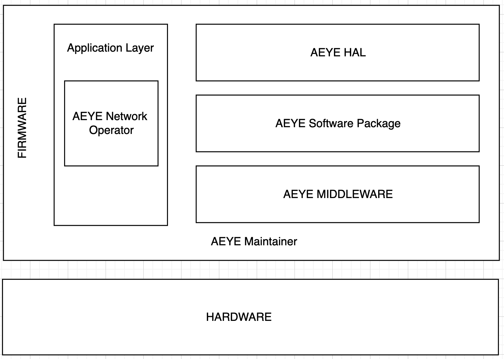

# AEYE_Maintainer
AEYE 프로젝트 Maintainer 서버 입니다

AEYE 프로젝트를 모니터링하기 위한 서버는 Django 기반으로 제작되었습니다. 이 서버는 AEYE Web Router와 AEYE AI와 연결되어 있으며, 두 서버로부터 전송된 로그를 바탕으로 Web 서버와 AI 서버의 상태를 확인합니다.

AEYE 프로젝트 WEB 서버:     

  

---

### AEYE 란?
AEYE는 AI를 통해 안저 질환을 구별하는 플랫폼입니다. OCT 이미지를 업로드하면, AI가 해당 이미지를 기반으로 추론하고, GPT를 활용하여 더 자세한 질환 판단 소견서를 작성합니다. AEYE는 이 서비스가 원활하게 동작할 수 있도록 웹 서버와 AI 서버를 분리하였으며, AI 서버에서는 GPU를 사용하여 이미지를 학습하고 추론합니다. AI 서버는 GPT와 연결되어 있어, AI가 추론한 키워드를 바탕으로 보다 상세한 안저 질환 소견서를 작성할 수 있습니다.

AEYE 프로젝트는 2024년 3월부터 2024년 8월까지 한국정보산업연합회의 지원을 받아 한이음 프로젝트로 진행되었습니다. 김경서, 박지원, 정윤철 총 3명으로 구성된 팀이 각각 FrontEnd, Database, BackEnd를 맡아 서로 다른 분야에서 프로젝트를 개발해왔습니다.

---
