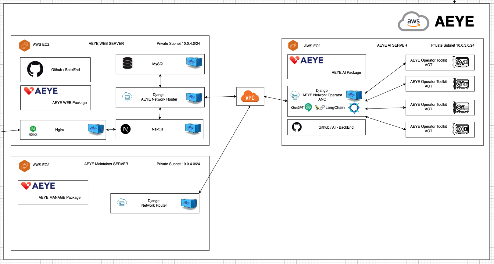
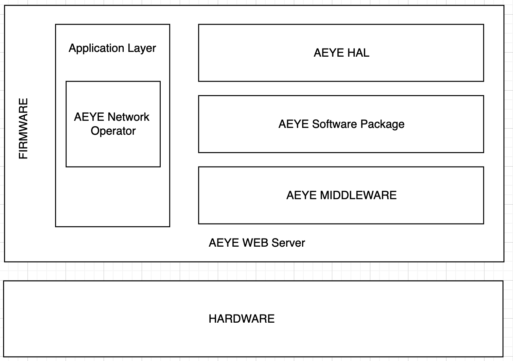
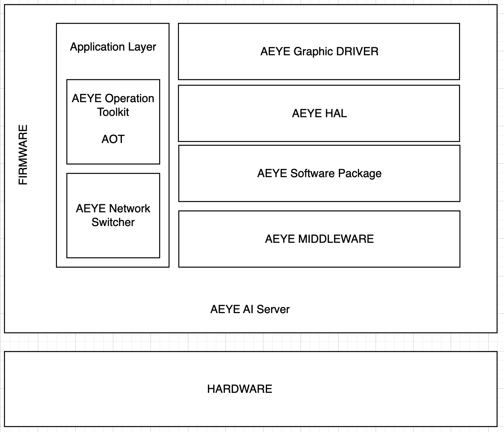

## 2024 한이음 AEYE 프로젝트
## AEYE 안저 질환 탐지 서비스

2024년도 한국정보산업연합회의 지원을 받아 한이음 프로젝트에 참여하여 개발한 AI 안저 질환 탐지 서비스입니다.

FrontEnd : [김경서](https://github.com/Gyeongse0) \
DataBase : [박지원](https://github.com/jiw3026) \
BackEnd : [정윤철](https://github.com/Yoonchulchung)

2024년 3월 ~ 2024년 8월까지 진행한 프로젝트입니다. 

통합된 리포지토리입니다 : [AEYE](https://github.com/2024-Hanium-A-EYE/AEYE) | [AEYE WEB](https://github.com/2024-Hanium-A-EYE/AEYE-WEB)     

세부 리포지토리 :     
- Next.js를 활용하여 AEYE 프로젝트의 웹 페이지를 제작하였습니다                  : [FrontEnd](https://github.com/2024-Hanium-A-EYE/AEYE-FE)       
- Django 를 활용하여 AEYE 프로젝트의 웹 벡엔드를 제작하였습니다                  :[Web BackEnd](https://github.com/2024-Hanium-A-EYE/AEYE_Router)      
- Django, Flask, Tensorflow를 활용하여 AEYE 프로젝트의 AI 서버를 제작하였습니다 :[AI](https://github.com/2024-Hanium-A-EYE/AEYE_AI)        
- Djaongo를 활용하여 AEYE 프로젝트를 모니터링하는 서버를 제작하였습니다            :[Maintainer](https://github.com/2024-Hanium-A-EYE/AEYE_Maintainer)      

AEYE 프로젝트는 Docker를 사용하여 환경에 영향을 받지 않고 동작할 수 있도록 설계되었습니다. 본 프로젝트는 AWS EC2 인스턴스 내에서 서비스가 운영되었으며, AWS EC2 인스턴스의 생성 및 관리는 Terraform을 사용하여 수행했습니다.    

AI 모델은 TensorFlow를 사용하였으며, AI가 추론한 데이터를 기반으로 GPT를 활용하여 진단에 도움이 되도록 설계했습니다. 웹 서버와 AI 서버는 다음과 같은 프레임워크를 기반으로 설계되었습니다.    

AEYE 프로젝트 전체 프레임워크:     
<p align="center">
  
</p>

AEYE 프로젝트 WEB 서버:     
<p align="center">
  
</p>


AEYE 프로젝트 AI 서버:     
<p align="center">
  
</p>


AEYE 프로젝트 모니터링 서버:     
<p align="center">
  
</p>


```
main    : 프로젝트 테스트까지고 끝난 완성된 버전
test    : 코드 작성이 끝나고 테스트 중인 버전
develop : 코드 작성중인 버전 
```

**test 브랜치**에서는 `Github Actions`를 통해 CI가 진행되어 작성된 코드가 정의된 테스트 기준에 충족하는지 평가합니다. `pytest` 프레임워크를 통해 pytest 플더에 정의된 테스트 기준에 충족하는지 평가합니다. 


## 서버 환경
**Python** : 3.6  
**Django** : 3.2  
**djangorestframework** : 3.13.1  
**Tensorflow** : 1.12  
**Keras** : 2.2.4  
**CUDA** : 9  

Python 버전은 AI 서버가 요구하는 Tensorflow 버전이 파이선 3.6에서 동작이 가능하여 일관성을 위해 AEYE 프로젝트의 모든 Python 버전을 3.6으로 통일시켰습니다. Django 3.2는 파이선 3.6에서 동작 가능한 Django 버전이어서 Django 3.2 버전을 사용했습니다.  
 

## 프로젝트 사용 방법
아래는 Linux 환경에서 AEYE 프로젝트를 시작하는 명령어 입니다.  
```bash
./installer
```
Shell을 시작하면 AEYE 웹 서버를 시작하기 위해 필요한 `dependencies`를 설치하고, Docker를 설치한 후, 본 프로젝트에서 정의한 Docker Compose를 통해 서버를 시작합니다. 
