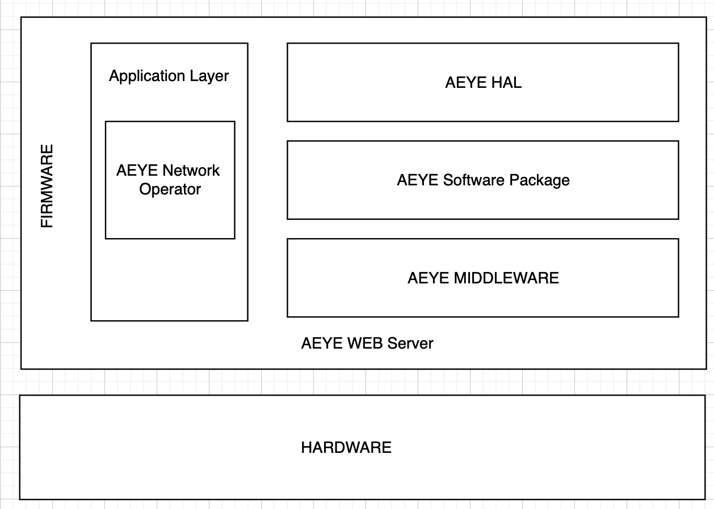

# AEYE_Router
This is the Web Router of the AEYE Project, which enables communication between Next.js and the AI Driver. This project started in April 2024 and is supported by the Federation of Korean Information Industries. We welcome you to join our AEYE project and contribute to its development.

## Quick Install
``` bash
./installer
```
## 🤔 What is AEYE?
AEYE is an AI doctor that can diagnose eye diseases, making it easier for doctors to diagnose without needing to see too many patients. This service includes OpticNet, which can classify images into three or four different categories.

[`AMD`, `DME`,`NORMAL`]  

[`CNV`, `DME`,`DRUSEN`,`NORMAL`]   

The AEYE Web Router consists of AEYE HAL, AEYE Software Package, AEYE Middleware, and AEYE Application, in order to integrate other features into the AEYE Project and deliver services effectively.  

<p align="center">
  
</p>


## Pre-requsite
- AEYE AI Driver     
- AEYE Front      
- AEYE SQL    


## License
The code is released under the MIT License, you can read the license file included in the repository for details.

